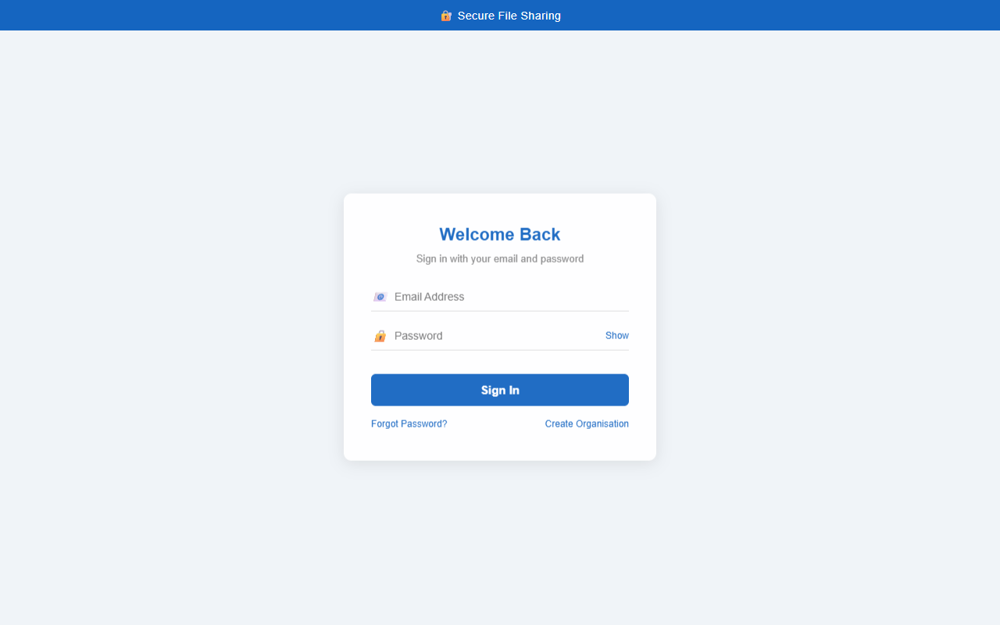
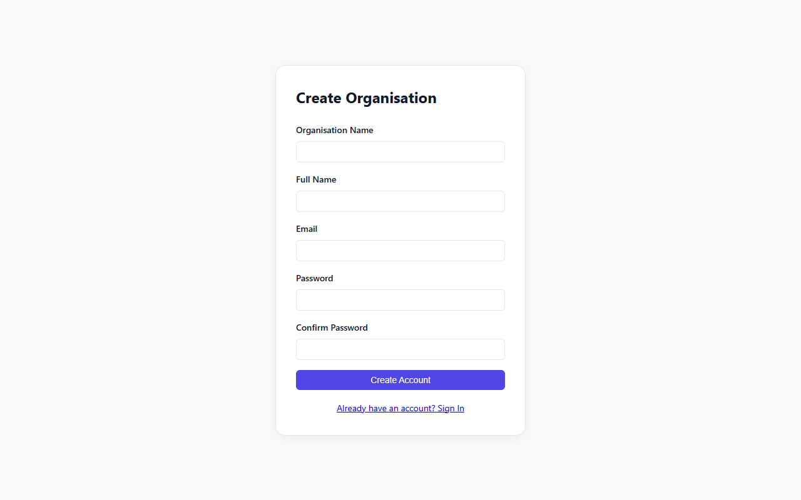
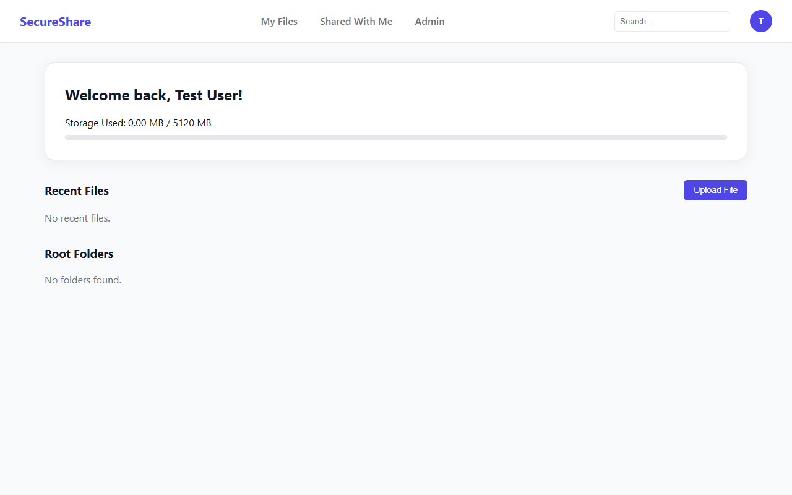

# SecureShare (SPS-System) Project Documentation

## Project Overview
SecureShare is a secure, cloud-based file management and sharing system designed for organizations. It is built using **Node.js, Express, and EJS** for the frontend rendering, with **PostgreSQL (via Neon)** serving as the relational database and **Cloudinary** handling secure, distributed file storage.

---

## Folder Structure
The project follows an MVC (Model-View-Controller) architecture:

```text
SPS-System/
├── src/
│   ├── config/       # Configuration files (DB, Cloudinary, Environment variables)
│   ├── controllers/  # Request handlers (Auth, File, Folder, User, Org, Views)
│   ├── middleware/   # Express middlewares (Auth, Rate Limiting, File Upload)
│   ├── models/       # Database schemas and models
│   ├── public/       # Static assets (CSS, JS, Images)
│   ├── routes/       # API and View route definitions
│   ├── services/     # External integrations (Cloudinary, Email/Nodemailer)
│   ├── views/        # EJS templates for frontend rendering
│   ├── app.js        # Express application setup
│   └── server.js     # Server entry point
├── .env.example      # Example environment variables
└── package.json      # Dependencies and scripts
```

---

## Technologies Used
- **Node.js & Express**: Core backend framework for routing and API creation.
- **EJS (Embedded JavaScript)**: Templating engine used for server-side HTML rendering.
- **PostgreSQL (Neon)**: Relational database used for storing user data, file metadata, and audit logs.
- **Cloudinary**: Cloud service used for storing the actual files securely.
- **Nodemailer**: Used for sending transactional emails via SMTP.
- **Bcrypt & JWT**: Used for password hashing and secure, stateless authentication.

---

## Core Integrations

### 1. Environment Variables (`.env` and `src/config/env.js`)
The application uses the `dotenv` package to load variables from `.env`. The `src/config/env.js` file centralizes and validates all required environment variables at startup. If critical variables like `DATABASE_URL` or `CLOUDINARY_API_KEY` are missing, the server throws an error and prevents startup.

```javascript
// src/config/env.js
require('dotenv').config();

const env = {
    NODE_ENV: process.env.NODE_ENV || 'development',
    PORT: parseInt(process.env.PORT, 10) || 3000,
    DATABASE_URL: process.env.DATABASE_URL,
    // ...
};

// Strict validation
if (!env.DATABASE_URL || env.DATABASE_URL.trim() === '') {
    throw new Error('Missing required env var: DATABASE_URL');
}
module.exports = env;
```

### 2. Neon Database Integration (`src/config/db.js`)
The database connection is established using the `pg` (node-postgres) package. It utilizes connection pooling to connect to a Neon serverless PostgreSQL instance using the `DATABASE_URL`.

```javascript
// src/config/db.js
const { Pool } = require('pg');
const env = require('./env');

const pool = new Pool({
    connectionString: env.DATABASE_URL,
    ssl: { rejectUnauthorized: false }
});

pool.on('error', (err) => {
    console.error('Unexpected DB pool error', err);
});

module.exports = pool;
```

### 3. Cloudinary Integration (`src/services/cloudinary.service.js`)
Files uploaded by users are not stored on the local server. Instead, they are streamed as buffers directly to Cloudinary. The integration relies on `CLOUDINARY_CLOUD_NAME`, `CLOUDINARY_API_KEY`, and `CLOUDINARY_API_SECRET`.

```javascript
// src/services/cloudinary.service.js
const cloudinary = require('../config/cloudinary');

async function uploadBuffer(buffer, options) {
    return new Promise((resolve, reject) => {
        const stream = cloudinary.uploader.upload_stream(options, (error, result) => {
            if (error) reject(error);
            else resolve(result);
        });
        stream.end(buffer);
    });
}
```

### 4. SMTP Email Verification (`src/services/email.service.js`)
Nodemailer is used to send organization invitations and password reset emails via SMTP. The transporter connects to the configured SMTP host and verifies the connection upon startup using `transporter.verify()`.

```javascript
// src/services/email.service.js
const nodemailer = require('nodemailer');
const env = require('../config/env');

const transporter = nodemailer.createTransport({
    host: env.SMTP_HOST,
    port: env.SMTP_PORT,
    secure: env.SMTP_PORT === 465,
    auth: {
        user: env.SMTP_USER,
        pass: env.SMTP_PASS
    }
});

// SMTP Verification
transporter.verify((error) => {
    if (error) {
        console.warn('Email transporter not ready:', error.message);
    } else {
        console.log('Email transporter ready');
    }
});
```

---

## Web Pages and Code Mappings

### 1. Landing Page
- **Route**: `GET /`
- **Controller**: `src/controllers/view.controller.js` -> `renderLanding`
- **View Code**: `src/views/landing.ejs`


```html
<!-- src/views/landing.ejs (Snippet) -->
<div class="hero">
    <h1>Secure File Sharing for Modern Teams</h1>
    <p>Store, share, and collaborate on files with enterprise-grade security.</p>
    <a href="/register" class="btn btn-primary">Get Started</a>
</div>
```

### 2. Login Page
- **Route**: `GET /login`
- **Controller**: `src/controllers/view.controller.js` -> `renderLogin`
- **View Code**: `src/views/auth/login.ejs`



```html
<!-- src/views/auth/login.ejs (Snippet) -->
<form id="login-form">
    <div class="form-group">
        <i class="icon-email"></i>
        <input type="email" id="email" placeholder="Email Address" required>
    </div>
    <div class="form-group">
        <i class="icon-lock"></i>
        <input type="password" id="password" placeholder="Password" required>
    </div>
    <button type="submit" id="login-btn" class="btn-primary">Sign In</button>
</form>
```

### 3. Registration Page
- **Route**: `GET /register`
- **Controller**: `src/controllers/view.controller.js` -> `renderRegister`
- **View Code**: `src/views/auth/register.ejs`



```html
<!-- src/views/auth/register.ejs (Snippet) -->
<form id="register-form">
    <div class="form-group">
        <label>Organisation Name</label>
        <input type="text" id="org_name" required>
    </div>
    <button type="submit" class="btn" style="width:100%;">Create Account</button>
</form>
```

### 4. User Dashboard
- **Route**: `GET /dashboard`
- **Controller**: `src/controllers/view.controller.js` -> `renderDashboard`
- **View Code**: `src/views/dashboard.ejs`



```html
<!-- src/views/dashboard.ejs (Snippet) -->
<div class="dashboard-header">
    <h2 class="text-2xl font-semibold mb-4">Welcome back, <%= user.full_name %></h2>
</div>
<div class="stats-grid">
    <div class="stat-card">
        <div class="stat-title">Total Files</div>
        <div class="stat-value"><%= stats.totalFiles %></div>
    </div>
</div>
```
